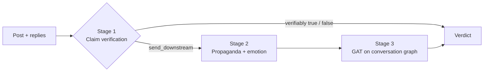

# Emotion-Enhanced Graph Attention Networks for Propaganda Detection in Social Media

A three-stage misinformation analysis pipeline for social media posts (English and Hindi), with a Streamlit UI:

1. **Claim verification**: extracts factual claims, retrieves evidence with Gemini search and returns a verdict.
2. **Propaganda + emotion scoring**: English/Hindi propaganda classifiers, GoEmotions reply emotions and a meta-classifier.
3. **Graph attention network (GAT)**: refines the decision using a graph of 1,154 historical conversations.



## Setup

Requires Python 3.10–3.12 (tested on 3.11). A GPU is optional.

```powershell
python -m venv .venv
.\.venv\Scripts\Activate.ps1
pip install -r requirements.txt
```

If `torch-geometric` fails to install, follow the [PyG install guide](https://pytorch-geometric.readthedocs.io/en/latest/install/installation.html) for your PyTorch/CUDA version.

## Download models and data

The trained models and datasets are too large for git. Download `propaganda_artifacts.zip` from this Google Drive folder:

**➡️ [Models and datasets (Google Drive)](https://drive.google.com/drive/folders/1yLrHTcTEQTKuxlxOIP3BKKw9PlubpaeR?usp=sharing)**

Unzip it **into the `artifacts/` folder** (merge with what is already there). You should end up with:

```text
Project_Propaganda Detection in Social Media/
├── app_complete.py
└── artifacts/
    ├── demo/                                        # already in the repo
    ├── models/
    │   ├── gat_propaganda/                          # already in the repo
    │   ├── eng_prop_model/SemEval_Trained_Intermediate(final)/
    │   ├── hprop-lora-adapter/
    │   ├── eng_emo_model/models/
    │   └── meta_classifier.joblib
    └── prop_datasets/tree_width/
        ├── merged_conversations.jsonl
        └── meta_features.csv
```

The sentence embedding model (`paraphrase-multilingual-mpnet-base-v2`) is downloaded automatically from Hugging Face on first run.

## Gemini API key (optional)

```powershell
$env:GEMINI_API_KEY = "your_key"
```

Without the key the app still runs: it skips Stage 1 (claim verification) and goes straight to the propaganda detection stages (2 and 3). Never commit keys.

## Run

Run these commands from the repository root:

```powershell
streamlit run app_complete.py   # full 3-stage UI
streamlit run app.py            # Stage 1 only (needs GEMINI_API_KEY, no downloads)
pytest                          # tests
```

In the UI, pick a sample from the sidebar (random, by index, or one of the Hindi demo threads), choose which stages to run, then click **Run Complete Pipeline**.

---

## How it works

### Stage 1: Claim verification

A five-step agent workflow ([src/graph.py](src/graph.py), [src/agents.py](src/agents.py)), driven by Gemini 2.5 Flash:

| Step | What it does |
| --- | --- |
| Claim detector | LLM check for whether the post contains any verifiable claim; opinion-only posts skip retrieval. |
| Claim extractor | Few-shot prompt that extracts claims as normalized English sentences with a confidence score. Claims below 0.3 confidence are dropped. Hindi claims are translated inline. |
| Evidence retriever | Gemini grounded web search per claim, returning URL, snippet and domain. |
| Claim verifier | Labels each evidence snippet SUPPORT / REFUTE / NEUTRAL and combines them into a `claim_score` in [0, 1]. |
| Final decider | Applies fixed rules to label the post `high_conf_true`, `high_conf_fake` or `send_downstream`. |

Decision rules, applied in order ([docs/FINAL_DECISION_RULES.md](docs/FINAL_DECISION_RULES.md)):

1. Missing scores or retrieval coverage below 0.5 → `send_downstream`
2. Any claim with `claim_score ≤ 0.10` and refute confidence ≥ 0.8 → `high_conf_fake`
3. All claims with `claim_score ≥ 0.90`, support confidence ≥ 0.8 and manipulation < 0.6 → `high_conf_true`
4. Otherwise (including neutral claims or high manipulation) → `send_downstream`

A lexical **manipulation score** flags emotionally loaded writing even when the claims check out:

```text
score = min(1, 0.4·caps_fraction + 0.2·(num_!?/10) + 0.3·(loaded_words/5) + 0.1·repeated_punctuation)
```

A `high_conf_true` or `high_conf_fake` verdict ends the pipeline. Everything else continues to Stage 2.

### Stage 2: Propaganda and emotion fusion

| Component | Model | Role |
| --- | --- | --- |
| English propaganda classifier | XLM-RoBERTa base, fine-tuned on SemEval propaganda data | Probability that the root post is propaganda (`text_pred`) |
| Hindi propaganda classifier | LoRA adapter on the same backbone (r=16, α=32, on query/value) | Used instead of the English head for Hindi posts |
| Emotion classifier | DistilBERT fine-tuned on GoEmotions (28 labels, multi-label) | Scores every reply; Hindi replies are machine-translated to English first |
| Meta-classifier | StandardScaler + logistic regression (scikit-learn) | Fuses the signals below into one propaganda probability |

The 28 GoEmotions labels are collapsed into 7 Ekman groups (anger, disgust, fear, joy, sadness, surprise, neutral) and averaged over all replies. The meta-classifier sees 10 features:

- `text_pred`: propaganda probability of the root post
- `mean_<emotion>` ×7: average Ekman emotion across replies
- `entropy`: spread of the average emotion distribution
- `variance`: how much emotions differ between replies

The idea is that propaganda tends to provoke a distinctive, coordinated emotional response in its replies, which the text alone doesn't show.

### Stage 3: Graph attention network

Every conversation is a node in a graph ([artifacts/models/gat_propaganda/](artifacts/models/gat_propaganda/)):

- **Node features (769-d):** 768-d multilingual MPNet embedding of the root post + the Stage 2 meta-classifier probability, each standardized separately.
- **Edges:** cosine similarity between embeddings, top 20 neighbours per node with similarity ≥ 0.3. That gives 1,154 nodes, 29,406 edges and an average degree of about 51.
- **Model:** 3 × `GATConv` (769 → 128×8 heads → 128×8 heads → 1), ELU, dropout 0.2, self-loops disabled so predictions have to come from neighbours.
- **Training:** focal loss (α=0.75, γ=1.5), Adam (lr 5e-3), gradient clipping at 5.0, early stopping on validation AUC (patience 50), stratified 80/10/10 split. Decision threshold is 0.55.
- **New posts:** posts not in the graph (e.g. the Hindi demos) are embedded on the fly and linked to their 5 most similar historical conversations, so no retraining is needed. The UI shows the neighbours and their attention weights, so you can see why a post was flagged.

## Data

| File | Contents |
| --- | --- |
| `merged_conversations.jsonl` | 1,154 conversations (577 propaganda, 577 not). Each has `post_id`, `root_text`, `replies` (about 50 on average) and `label`. |
| `meta_features.csv` | Stage 2 features for the same conversations, used to train the meta-classifier and GAT |
| Hindi demo threads | Four synthetic Hindi conversations built into `app_complete.py` for demonstrating multilingual inference |

## Results

| Model | Accuracy | F1 | AUC |
| --- | --- | --- | --- |
| Text-only baseline | 54% | 40% | ~55% |
| Meta-classifier (Stage 2) | 66% | 65% | ~70% |
| **GAT (Stage 3)** | **81.9%** | **83.2%** | **86.2%** |

Adding reply emotions (Stage 2) improves on the text-only classifier, and adding conversation-graph context (Stage 3) adds a further ~16 points of accuracy and ~18 of F1. The meta-classifier's best F1 is 0.693, at threshold 0.4. More detail is in [artifacts/models/gat_propaganda/README.md](artifacts/models/gat_propaganda/README.md).

## Retraining

Run these from the repository root after downloading the data. Each script has `--help` for its options.

```powershell
python scripts/build_meta_dataset.py        # emotion + text features -> meta_features.csv
python scripts/train_meta_classifier.py     # -> artifacts/models/meta_classifier.joblib
python scripts/train_gat_propaganda.py --use-semantic-graph --neighbor-k 20 --similarity-threshold 0.3 --lr 5e-3 --epochs 500 --patience 50 --seed 42
```

The last command reproduces the published GAT. Other scripts in `scripts/` evaluate the individual models (`test_*.py`, `evaluate_prop_model.py`) and plot the graph (`visualize_gat_graph.py`).

## Repository layout

| Path | Contents |
| --- | --- |
| `app_complete.py` | Full Streamlit UI (all three stages) |
| `app.py` | Stage 1 Streamlit UI |
| `src/` | Claim verification graph, agents, API clients |
| `scripts/` | Training, evaluation and dataset tools |
| `artifacts/models/` | All models; the GAT (`gat_propaganda/`) is committed, the rest come from the zip |
| `artifacts/prop_datasets/` | Datasets from the zip |
| `docs/` | Decision rules, guardrails, technical notes |
| `tests/` | Stage 1 smoke test |

## Limitations

- **Stage 1 needs Gemini.** Claim extraction and verification quality depend on the Gemini API.
- **Hindi support is thin.** The Hindi adapter was trained partly on synthetic data, and translating replies before emotion scoring can lose nuance.
- **The graph is static.** It reflects the narratives in the training data; as new narratives appear, the embeddings and edges should be rebuilt.
- **Attention is not a full explanation.** Neighbour attention weights show which conversations influenced a decision, not why.
